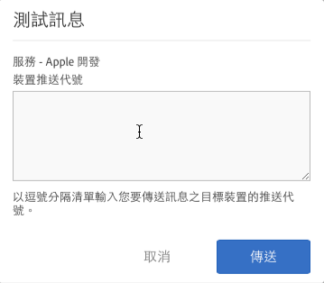

# Prerequisites to enable push messaging {#prerequisites-to-enable-push-messaging}

您必須先完成這些工作，才能在應用程式中設定推播訊息。

## 為您的公司啟用Experience Cloud

貴公司已採用 Adobe Analytics，必須啟用 Experience Cloud。您可以驗證您的Adobe銷售代表的狀態。

## Install and configure the Mobile SDK

* **安裝 Mobile SDK**

   若要設定推播訊息，您必須下載並安裝至少4.6版或更新版本的Mobile SDK。 For more information, see [Download the SDKs](/help/using/c-manage-app-settings/c-mob-confg-app/t-config-analytics/download-sdk.md).

* **設定推播服務**

   您必須在 Mobile SDK 中設定推送服務。如需詳細資訊，請參閱下列內容:

   * [Android中的推播訊息](/help/android/messaging-main/push-messaging/push-messaging.md)
   * [iOS中的推送訊息](/help/ios/messaging-main/push-messaging/push-messaging.md)

## Log in to the Mobile Core Service using your Adobe ID

>[!IMPORTANT]
>
>若要使用推播服務功能，使用者必須使用其Adobe ID登入Mobile核心服務，且其Analytics帳戶必須連結至其Adobe ID。 如果使用者使用其現有的 Adobe Analytics 帳戶登入，將無法使用推送服務功能。

如果使用者沒有 Adobe ID，請執行下列步驟:

1. (**Experience Cloud Administrator**) Invite users to the Experience Cloud.

1. (**User**) Create a personal Adobe ID using the instructions that you received from the Experience Cloud administrator.

   系統管理員完成前一步驟後，系統會自動傳送電子郵件訊息給每位使用者。

1. (**Users**) Log in to Mobile using their Adobe ID.

## 在Experience cloud中連結使用者帳戶

每位使用者必須從 Experience Cloud 組織連結 Analytics 解決方案帳戶。

1. 若要使用 Adobe ID 登入 Experience Cloud，請在瀏覽器中輸入 [https://marketing.adobe.com](https://marketing.adobe.com)。

1. 在右上角選取 Analytics 公司名稱。

1. 按一下&#x200B;**[!UICONTROL 「新增組織」]**，接著從下拉式清單中選取&#x200B;**「Adobe SiteCatalyst/Adobe Social」[!UICONTROL 。]**

1. Type the company name, your legacy credentials for the specified company, and click **[!UICONTROL Link Account]**.

   Adobe ID 現在已連結至您的 Analytics 帳戶、公司以及登入憑證。

如需詳細資訊，請參閱[疑難排解帳戶連結](https://marketing.adobe.com/resources/help/en_US/mcloud/organizations.html)。

## 在行動使用者介面中設定推播服務和SDK ID服務

在您啟用應用程式的 ID 服務前，**[!UICONTROL 「推送服務」]區段為停用狀態。**&#x200B;但是，在您啟用ID服務後，「推送服務」區段即會啟用。 如需啟用推播服務的詳細資訊，請參 [閱「設定SDK ID服務選項」](/help/using/c-manage-app-settings/c-mob-confg-app/t-config-visitor.md)。

>[!IMPORTANT]:您必須按一 **[!UICONTROL 下「儲存]** 」，以儲存變更並重新整理推送服務。
>
>在每個報表套裝中，您可以針對 Apple 和 Google 各配置一個應用程式商店應用程式。若您需要額外應用程式，例如針對生產和開發環境各配置一個應用程式，請針對這兩個環境各自設定新應用程式商店應用程式以及新報表套裝。

* **Apple:** 請拖放私密金鑰及/或憑證。如果私密金鑰使用密碼加密，請輸入其密碼。

   * 如果設定的是&#x200B;**私密金鑰**，請將私密金鑰檔案拖放至方塊中。

      您也可以按一下「**[!UICONTROL 瀏覽]」來選取檔案。**&#x200B;此檔案包含私密金鑰。The certificate might also be included in this file (`.p12`, `pkcs12`, `.pfx`, `.key`, `.pem`).

   * 如果設定的是&#x200B;**私密金鑰密碼** (私密金鑰檔案加密)，請輸入密碼。

      (條件式) 如果設定的是&#x200B;**憑證**，請將憑證檔案拖放至方塊中。您也可以按一下「**[!UICONTROL 瀏覽]」來選取檔案。** This field is not required if the private-key file also contains the certificate ( `.cert`, `.cer`, `.crt`, `.pem`).

* **Google:**&#x200B;請指定應用程式的 API 密鑰。

   按一下&#x200B;**[!UICONTROL 「測試」]，驗證應用程式和 Mobile Services 是否已正確設定。**&#x200B;此選項可以用來除錯和疑難排解。

   輸入您要傳送訊息的目標裝置推送代號。以逗號分隔清單指定代號，即可傳送訊息給多部裝置。

   
