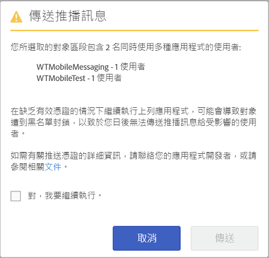

# 對象: 推送訊息{#audience-define-and-configure-audience-segments-for-push-messages}

您可以定義和設定推送訊息的對象選項，包含日期範圍選項、Analytics 區段和自訂區段。

## 定義對象區段 {#section_7C4D2393CF7441959FE2381A02867CAC}

建立推播訊息的對象區段時，該區段可能會涉及一個或多個應用程式的使用者，因為報表套裝或虛擬報表套裝可能包含一個或多個應用程式的資料。 For more information about virtual report suites, see [Virtual report suites](/help/using/manage-apps/c-mob-vrs.md).

在Adobe Mobile Services中，行銷人員可能只會推送至每個平台一個應用程式。 如果行銷人員嘗試推送至包含來自多個應用程式之使用者的區段，會顯示警告，指出繼續作業可能導致嚴重的推播失敗，並可能導致使用者的拒絕清單。 如果您遇到推送失敗，請參閱&#x200B;*解決推送失敗*，位置在:  [疑難排解推送訊息](/help/using/in-app-messaging/t-create-push-message/c-schedule-push-message.md)。

若要使用區段定義中的 Audience Manager 資料，請參閱 [Audience Analytics](https://docs-author-stg.corp.adobe.com/content/help/en/analytics/integration/audience-analytics/mc-audiences-aam.html)。

>[!IMPORTANT]
>
>If app users are deny listed, marketers can **never** send push messages to those affected users again.

如果選擇含有來自多個應用程式的使用者之對象區段，您可能會看到下列警告:

應用程式名稱以 appId 的簡化版為依據，Mobile Services SDK 會以 `<app name> <version number> (<bundle id>)` 格式自動將其傳送至 Adobe Analytics。

>[!TIP]
>
>版本編號為選填。

最多會移除6組版本編號和5組套件ID編號。

例如:

* `Bea[rd]cons 1.0 (123)` 將顯示為 `Bea[rd]cons`
* `Bea[rd]cons 1.2 (1.2)` 將顯示為 `Bea[rd]cons`
* `Bea[rd]cons 1.2.3.4.5.6.7 (1111)` 將顯示為 `Bea[rd]cons .7`
* `Bea[rd]cons 1.2.3. (1.2.3.4.5.6)` 將顯示為 `Bea[rd]cons (.6)`

若要繼續將推送訊息傳送至列出的應用程式，請選取&#x200B;**[!UICONTROL 「是，我要繼續。」]**&#x200B;核取方塊，然後按一下&#x200B;**[!UICONTROL 傳送]**。

## 最佳作法

以下是一些需記住的最佳作法:

* 為了減少混淆狀況，請&#x200B;**避免**&#x200B;定義含有來自多個應用程式資料的行動應用程式虛擬報表套裝。
* **每次**&#x200B;要傳送推送訊息時，都使用唯一的應用程式 ID 做為對象區段的一部分。此舉可確保推送訊息傳送至&#x200B;**只**&#x200B;隸屬一個應用程式的對象區段。

### 範例

以下是一些範例，可協助您瞭解如何正確定義區段：

**執行**: 行銷人員會針對一個應用程式的iOS和Android版本（例如Adobe Photoshop）提供推播憑證。 行銷人員可能會傳送推播通知給橫跨兩個平台的使用者區段。

**不要**: 行銷人員針對單一應用程式的iOS和Android版本提供推播憑證，例如Adobe Photoshop。 如果行銷人員在過去30天內建立並推送至所有使用中使用者的區段 **，則只有Adobe Photoshop iOS和Android應用程式的使用者會收到推送，而所有Adobe Illustrator iOS和Android應用程式的使用者都會被拒絕列出。 如需更多詳情，請參閱&#x200B;*解決推送訊息失敗*&#x200B;中的範例，位置在:  [疑難排解推送訊息](/help/using/in-app-messaging/t-create-push-message/c-troubleshooting-push-messaging.md)。

## 設定對象區段 {#section_A92C60885A30421B8150820EC1CCBF13}

1. 前往新推送訊息的「對象」頁面。

   如需詳細資訊，請參閱[建立推送訊息](/help/using/in-app-messaging/t-create-push-message/t-create-push-message.md)。

   設定對象選項時，請記住以下&#x200B;**重要**&#x200B;資訊:

   * **[!UICONTROL 「預估選擇加入對象」]**&#x200B;是指符合 Adobe Analytics 區段的裝置數量&#x200B;**及**&#x200B;選擇加入的裝置數量。

      您可以檢視所選區段中選擇接收訊息並將接收推播訊息的使用者人數預估。 應用程式使用者總數會顯示在估計值下方，無論選擇加入狀態為何。

   * **[!UICONTROL 「總計」]**&#x200B;是指符合 Adobe Analytics 區段的裝置數量。

   * 推送訊息會傳送至作為已定義 Adobe Analytics 區段一部分的裝置&#x200B;**以及**&#x200B;已選擇加入推送訊息的裝置。

      這代表 SDK 已針對「推送訊息選擇加入」的 evar 傳送 `True` 值。

   * 即使裝置具備有效的裝置代號，除非 Adobe Analytics 已設定選擇加入的旗標，否則訊息不會推送至裝置。

   * 如需疑難排解推送訊息的詳細資料，請參閱下列內容:

      * [iOS 中的推播訊息](https://docs.adobe.com/content/help/zh-Hant/mobile-services/ios/messaging-ios/push-messaging/push-messaging.html)

      * [Android 中的推播訊息](https://docs.adobe.com/content/help/zh-Hant/mobile-services/android/messaging-android/push-messaging/push-messaging.html)

1. 在下列欄位輸入資訊:

   * **[!UICONTROL 期間為]**

      輸入用於預計對象的時間範圍。從&#x200B;**[!UICONTROL 「於此期間」]**&#x200B;下拉式清單中選取一個選項:

   * **[!UICONTROL 「最近」]**&#x200B;可讓您選取相對於排定推送訊息之時間的時間範圍 (例如最近 7 天、最近 30 天或最近 60 天)。

      舉例來說，如果您選取最近 30 天並排程在 10 月 31 日推送訊息，則預計對象會是 10 月 31 日前 30 天選擇收到推送訊息的使用者人數。

   * **[!UICONTROL 「固定範圍」]**&#x200B;可讓您挑選預計對象範圍的開始和結束日期，以選取固定範圍。

      以前一個例子為例，如果您選取開始於 10 月 1 日且結束於 10 月 15 日的時間範圍，但排程在 10 月 31 日推送訊息，則預計對象會是在您指定之固定時間範圍 (10 月 1 日到 10 月 15 日) 內選擇收到推送訊息的使用者人數。

   * **[!UICONTROL Analytics 區段]**

      從下拉式清單中選取現有的 Adobe Analytics 區段。如需詳細資訊，請參閱[建立區段](https://docs.adobe.com/content/help/zh-Hant/analytics/components/segmentation/segmentation-workflow/seg-build.html)。

   * **[!UICONTROL 自訂區段]**

      從下拉式清單中選取量度或變數 (例如&#x200B;**[!UICONTROL 上次使用後間隔天數]**&#x200B;或&#x200B;**[!UICONTROL 地標]**)，接著視需要設定篩選器。例如，下列自訂區段會鎖定位於加州 (美國) 區域內，使用執行 iOS 之行動電話的使用者。
   >[!IMPORTANT]
   >
   >在&#x200B;**[!UICONTROL 建立對象]**&#x200B;區段中，如果按一下&#x200B;**[!UICONTROL 和]**，便會顯示一個對話方塊，提醒您確定所列出的每個應用程式&#x200B;**都必須**&#x200B;具備有效的憑證。如果按一下&#x200B;**[!UICONTROL 或]**，則會顯示預設的對話方塊。如需有效憑證和報表套裝的詳細資訊，請參閱[虛擬報表套裝](/help/using/manage-apps/c-mob-vrs.md)。
