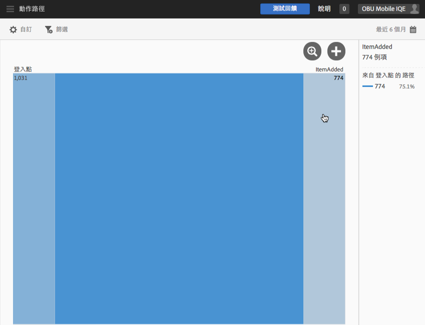
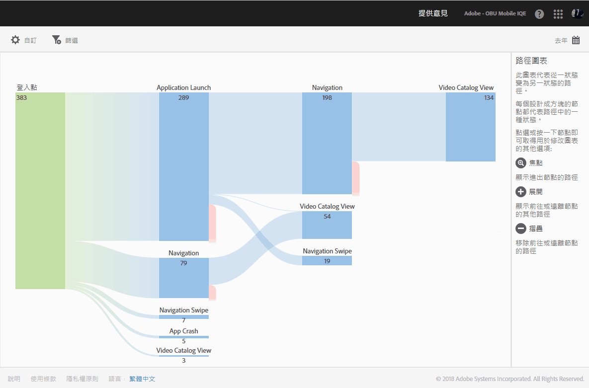

# 動作路徑報表{#action-paths}

「動作路徑」報表可依據路徑分析顯示路徑圖表，用來代表使用者在應用程式中從某狀態轉換到另一個狀態所採行的路徑。

**[!UICONTROL 「檢視路徑」]**&#x200B;和&#x200B;**「動作路徑」[!UICONTROL 報表都是路徑分析報表。]****[!UICONTROL 「檢視路徑」]報表可讓您查看使用者在您的應用程式中如何從一個畫面瀏覽至下一個畫面。****[!UICONTROL 「檢視動作」]報表則可讓您查看使用者在您應用程式中執行的動作和事件 (如: 點擊、選取、重新調整大小等等) 順序。**

>[!TIP]
>
>您可以使用漏斗報表將導覽和動作結合在一個報表中。 For more information, see [Funnel](/help/using/usage/reports-funnel.md).

每個節點 (形狀像方塊) 代表使用者在應用程式中通過路徑的一個狀態。例如，在上圖中，頂端節點代表啟動應用程式接著從圖庫中挑選相片的使用者人數。

To display the options to modify the chart, click a node and click **[!UICONTROL Focus]** or **[!UICONTROL Expand]**. 例如，按一下頂端節點中的 **[!UICONTROL PhotoPicked]** 狀態後會顯示&#x200B;**[!UICONTROL 「焦點」]和**「展開」]圖示。**[!UICONTROL **

To expand, click the **[!UICONTROL +]** icon. 此選項會顯示進入或離開節點等其他路徑。在下圖中，狀態 1 代表正在啟動應用程式，狀態 2 代表正在挑選相片 (您先前展開的項目)，而狀態 3 則包含使用者瀏覽的不同路徑:

* 選取項目
* 新增項目
* 拖曳項目
* 調整項目大小

展開狀態類似於漏斗。

To isolate the node and show paths that come into, and go out of the selected node, click the   icon. 下圖顯示使用者選取相片&#x200B;**之前**&#x200B;所完成的路徑:

* 旋轉項目
* 調整項目大小
* 拖曳項目
* 移除項目

在已選取相片的使用者當中，他們會在完成下列路徑&#x200B;**之後**&#x200B;才選取相片:

* 選取項目
* 新增項目
* 拖曳項目
* 調整項目大小

您可以聚焦或展開多個節點，詳細檢視使用者在您應用程式中採行的路徑。例如:

您可以為此報表配置下列選項:

* **[!UICONTROL 時段]**

   按一下&#x200B;**[!UICONTROL 「日曆」]圖示以選取自訂時段，或從下拉式清單中選擇預設時段。**

* **[!UICONTROL 自訂]**

   您可以透過變更&#x200B;**[!UICONTROL 「顯示方式」]選項、新增量度和篩選器以及新增其他系列 (量度) 等方式來自訂報表.** For more information, see [Customize reports](/help/using/usage/reports-customize/reports-customize.md).

* **[!UICONTROL 篩選]**

   按一下&#x200B;**[!UICONTROL 「篩選」]可以建立跨越不同報表的篩選器，以查看在所有行動報表中的表現情形。**&#x200B;嚴格篩選可讓您定義套用到所有非路徑報表的篩選器。For more information, see [Add a sticky filter](/help/using/usage/reports-customize/t-sticky-filter.md).

* **[!UICONTROL 下載]**

   Click **[!UICONTROL PDF]** or **[!UICONTROL CSV]** to download or open documents and share with users who do not have access to Mobile Services or to use the file in presentations.