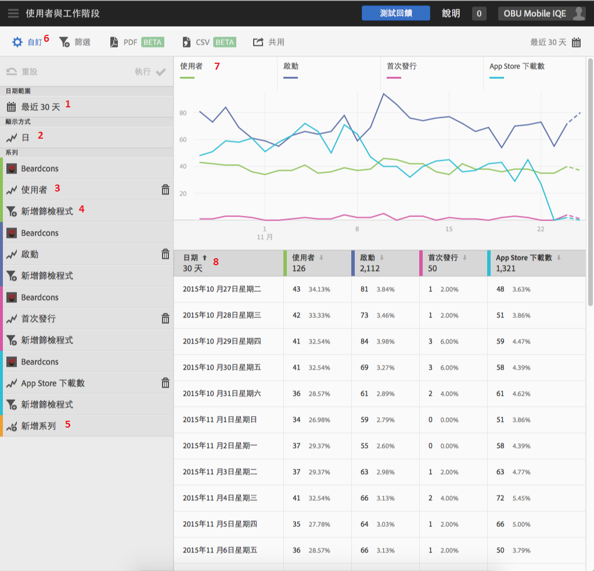

# 自訂報表{#customize-reports}

此資訊能協助您瞭解及自訂內建的報表。

您可以透過變更日期範圍、**[!UICONTROL 「顯示方式」]**&#x200B;選項 (依時段或依維度顯示圖形和表格資料)、新增量度和篩選器、新增其他系列 (量度) 等方式自訂報表。

若要顯示「自訂」邊欄，請按一下應用程式的名稱，前往「概述」頁面，然後按一下&#x200B;**[!UICONTROL 自訂]**。

以下範例顯示開啟了&#x200B;**[!UICONTROL 「自訂」]**&#x200B;邊欄的「使用者與工作階段」報表。此範例顯示最近 30 天的資料，依日數顯示，且有四個使用中系統:

* **[!UICONTROL 使用者]**
* **[!UICONTROL 啟動]**
* **[!UICONTROL 首次啟動]**
* **[!UICONTROL App Store 下載數]**

以下資訊說明報表的每個區域以及&#x200B;**[!UICONTROL 自訂]**&#x200B;邊欄:

| 數字 | 說明 |
|--- |--- |
| 1 | **[!UICONTROL 日期範圍]**&#x200B;中的下拉式清單可讓您為報表選取各種日期範圍。圖表 (9) 和對應表格 (10) 中的所有資料都遵照選取的日期範圍。 |
| 2 | **[!UICONTROL 顯示方式]**&#x200B;中的下拉式清單可讓您為報表選取以時間或維度顯示。例如，在上圖中，您可以看到已選取「天」。如果查看圖表 (7) 下方的日期以及表格 (8) 中的列，資料是依時相報表中的日期分類。您可以在時相報表中加入更多系列，此報表最多可報告六個量度。如果選取「生命週期」維度，可以檢視排名清單中的前 50 個值、日趨勢或週趨勢前 5 個值，或是前 5 個或前 10 個值的劃分。 |
| 3 | **[!UICONTROL 系列]**&#x200B;代表個別量度，例如上述範例中的使用者、啟動、首次啟動和應用程式商店下載。每個系列都以色彩標示圖表 (7) 和表格 (8) 中的資料。您可以新增其他系列 (量度)，甚至是不同報表套裝中的其他應用程式來比較資料。如需詳細資訊，請參閱[新增系列 (量度) 至報表](/help/using/usage/reports-customize/t-reports-series.md)。 |
| 4 | **[!UICONTROL 新增篩選器]**&#x200B;可讓您透過新增其他篩選器 (區段) 來自訂內建報表。如需詳細資訊，請參閱[新增篩選器至報表](/help/using/usage/reports-customize/t-reports-customize.md)。 |
| 5 | **[!UICONTROL 新增系列]**&#x200B;可讓您藉由新增其他系列 (量度) 或不同報表套裝中的應用程式來比較資料，進而自訂內建報表。如需詳細資訊，請參閱[新增系列 (量度) 至報表](/help/using/usage/reports-customize/t-reports-series.md)。 |
| 6 | **[!UICONTROL 嚴格篩選]**&#x200B;可讓您建立跨越不同報表的篩選器。您想要查看特定區段在所有行動報表中的表現情形時即可使用。嚴格篩選可讓您定義套用到所有非路徑報表的篩選器。如需詳細資訊，請參閱[新增嚴格篩選](/help/using/usage/reports-customize/t-sticky-filter.md)。 |
| 7 | **[!UICONTROL 「資料圖表」]**&#x200B;會根據所選量度在適當的圖表中顯示資料。圖表類型包括折線圖、橫條圖、環圈圖等。 |
| 8 | **[!UICONTROL 「日期表格」]**&#x200B;會以表格形式顯示資料。您可以按一下任何欄標題，依遞增或遞減順序排序資料。 |
