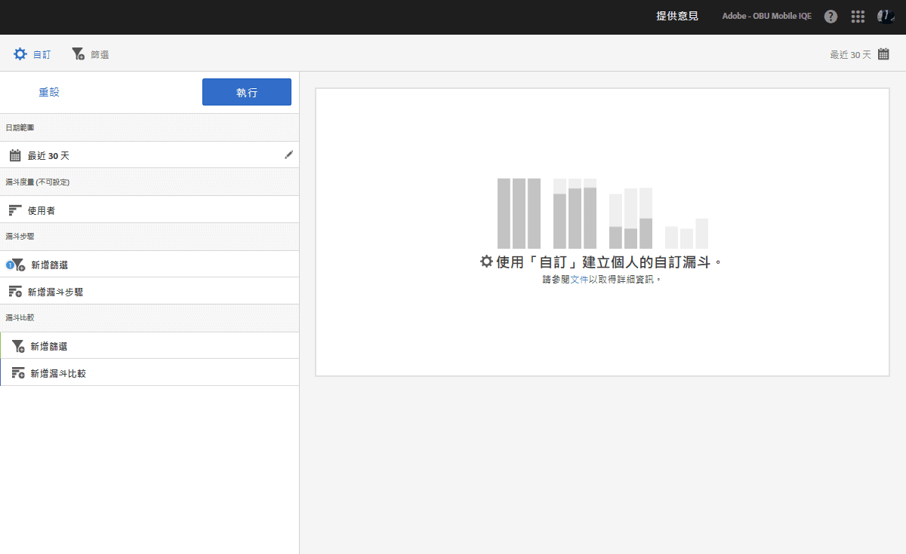

# 漏斗報表{#funnel}

**[!UICONTROL 漏斗]報表可讓您識別客戶在與您的行動應用程式互動時，在哪個位置離開促銷活動或是從定義的轉換路徑轉向。**&#x200B;您也可以使用&#x200B;**[!UICONTROL 「漏斗」]報表來比較不同區段的動作。**

洞察客戶在每個步驟的決策，可讓您瞭解他們在哪裡停住不再往前、傾向採取哪個路徑，以及何時離開您的應用程式。

如果要開啟&#x200B;**[!UICONTROL 「漏斗」]報表，您必須建立自訂漏斗。**&#x200B;如需詳細資訊，請參閱[自訂報表](/help/using/usage/reports-customize/reports-customize.md)。

>[!TIP]
>
>若要儲存自訂漏斗，請在配置設定以及執行報表後儲存 URL。您可將 URL 分享給他人，或將其儲存在文件中。

以下為此報表的範例:

為了展示簡易漏斗，以下顯示的配置設定使用了三個漏斗步驟和兩個漏斗進行比較。假設有一個示範應用程式，可讓使用者新增項目 (如: 相片)，接著分享該項目。

「自訂」視窗中有一些區段會指出使用者已啟動應用程式；從應用程式內的圖庫新增相片；以及從應用程式透過社交媒體、簡訊、電子郵件分享一或多張相片分享等資訊。漏斗比較可讓您在 iOS 應用程式使用者和 Android 應用程式使用者之間，比較他們新增和分享相片的程度。

若要產生報表，請按一下&#x200B;**[!UICONTROL 執行]**。

以下是產生的報表範例:

第一個系列顯示有 100% 的使用者啟動了應用程式。第二個系列顯示較高比例的 Android 使用者從圖庫新增了相片。第三個系列顯示將近一半的 iOS 使用者分享了相片，但沒有任何 Android 使用者分享相片。這可能表示應用程式發生問題，需要進行調查。

若要顯示其他資訊，請將滑鼠游標移至圖表中任何長條圖的上方。

您可以為此報表配置下列選項:

* **[!UICONTROL 時段]**

   按一下&#x200B;**[!UICONTROL 「日曆」]圖示以選取自訂時段，或從下拉式清單中選擇預設時段。**
* **[!UICONTROL 自訂]**

   您可以透過變更&#x200B;**[!UICONTROL 「顯示方式」]選項、新增量度和篩選器以及新增其他系列 (量度) 等方式來自訂報表.**&#x200B;如需詳細資訊，請參閱[自訂報表](/help/using/usage/reports-customize/reports-customize.md)。
* **[!UICONTROL 篩選]**

   按一下&#x200B;**[!UICONTROL 「篩選」]可以建立跨越不同報表的篩選器，以查看在所有行動報表中的表現情形。**&#x200B;嚴格篩選可讓您定義套用到所有非路徑報表的篩選器。如需詳細資訊，請參閱[新增嚴格篩選](/help/using/usage/reports-customize/t-sticky-filter.md)。
* **[!UICONTROL 下載]**

   按一下 **[!UICONTROL PDF]** 或 **[!UICONTROL CSV]** 可下載或開啟文件，以及分享給無法存取 Mobile Services 的使用者，或是在簡報中使用檔案。