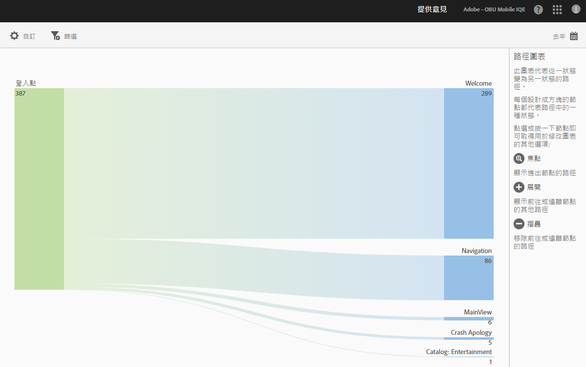

# 檢視路徑報表 {#view-paths}

**[!UICONTROL 「檢視路徑」]報表可依據路徑分析顯示路徑圖表，用來代表使用者在應用程式中從某狀態轉換到另一個狀態所採行的路徑。**

>[!TIP]
>
>The **[!UICONTROL View Paths]** and **[!UICONTROL View Action]** reports are similar because both are pathing reports. **[!UICONTROL 「檢視路徑」]報表可讓您查看使用者在您的應用程式中如何從一個畫面瀏覽至下一個畫面，**&#x200B;而&#x200B;**[!UICONTROL 「檢視動作」]報表則可顯示使用者在應用程式中的動作 (包括: 點擊、選取、重新調整大小等事件) 執行順序。**&#x200B;您可以使用漏斗報表將導覽和動作結合在一個報表中。 For more information, see [Funnel](/help/using/usage/reports-funnel.md).

每個節點 (形狀像方塊) 代表使用者在應用程式中通過路徑的一個狀態。例如，在上圖中，頂端節點代表啟動應用程式後接著瀏覽至主檢視頁面的使用者人數。

如要取得其他可用來修改圖表的選項，按一下節點，其他選項 (如:**[!UICONTROL 「焦點」]**&#x200B;或&#x200B;**「展開」]) 就會顯示。[!UICONTROL **&#x200B;例如，如果您按一下頂端節點中的&#x200B;**[!UICONTROL 「MainView」]**&#x200B;狀態，就會顯示&#x200B;**[!UICONTROL 「焦點」]和**「展開」]圖示。**[!UICONTROL **

To expand the view, click the **[!UICONTROL +]** icon to display the additional paths that come in to or go from the node. 在上圖中，狀態 1 代表正在啟動應用程式，狀態 2 代表正在檢視應用程式的主檢視頁面，而狀態 3 則包含使用者瀏覽的路徑如下:

* 瀏覽至相機膠卷
* 瀏覽至項目選取器
* 瀏覽至相機
* 瀏覽至項目資訊頁面

Click  to isolate the node and to show the paths that are coming into and going out of the selected node. 在下圖中，使用者檢視應用程式主檢視頁面之前先瀏覽過下列路徑:

* 項目資訊
* 項目選取器
* 相機膠卷
* 相機

您可以聚焦或展開多個節點，詳細檢視使用者在您應用程式中採行的路徑。例如:

您可以為此報表配置下列選項:

* **[!UICONTROL Time Period
Click the Calendar icon to select a custom period or to select a preset time period from the drop-down list.]******
* **[!UICONTROL Customize
Customize your reports by changing the Show By options, adding metrics and filters, and adding additional series (metrics), and more.]****** For more information, see [Customize Reports](/help/using/usage/reports-customize/reports-customize.md).
* **[!UICONTROL 篩選]**&#x200B;按一 **[!UICONTROL 下篩選]** ，建立跨越不同報表的篩選，以查看區段在所有行動報表上的執行情形。 嚴格篩選可讓您定義套用到所有非路徑報表的篩選器。如需詳細資訊，請參 [閱新增嚴格篩選](/help/using/usage/reports-customize/t-sticky-filter.md)。
* **[!UICONTROL 下載]**&#x200B;按一 **[!UICONTROL 下PDF]** 或 **[!UICONTROL CSV]** ，以下載或開啟檔案，並與無權存取Mobile services或在簡報中使用檔案的使用者共用。